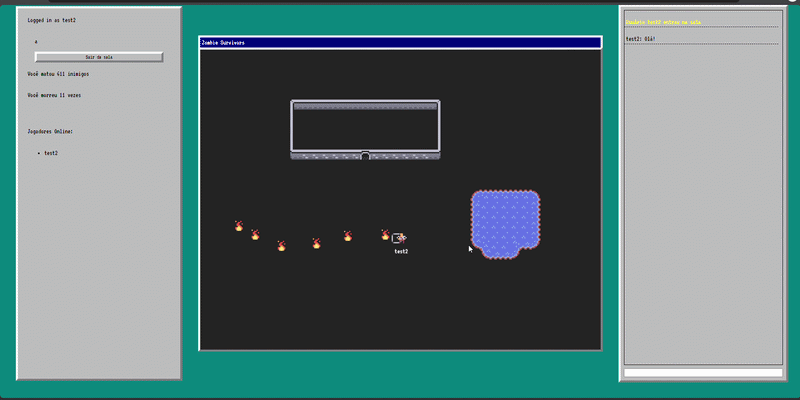

# Projeto: Aplicação com persistência de dados em backend




## Acesso

https://elc1090.github.io/project2-2026b-victormsferreira/

## Desenvolvedor(a)
Victor Mateus Severo Ferreira, Ciência da Computação


## Proposta
Desenvolvimento de um jogo simples demonstrando multiplayer em tempo real.

## Parceria/cliente/usuário
Substitua este texto pela identificação do(a) colega parceiro(a)

## Feedback/comentário da parceria/cliente/usuário
Substitua este texto por um feedback produzido pelo(a) colega parceiro(a). Na modalidade A (parceria dev), o foco principal do feedback/comentário estará nas diferenças percebidas no código. Na modalidade B (parceria cliente/usuário), o foco principal do feedback/comentário estará nas funcionalidades/interface.

## Desenvolvimento

### Processo

Iniciei o processo tentando acessar e entender a funcionalidade realtime do Supabase. Como não tenho nenhuma experiência nessa área, tive que reler a documentação relevante múltiplas vezes até conseguir ter um cliente simples em typescript onde um usuário pode mandar uma mensagem e outros usuários conectados na mesma sala a recebem. Uma das partes que mais demorou foi o processo de simplesmente carregar e usar a biblioteca do supabase no navegador, pois o compilador do typescript estava configurado para gerar código para ser rodado através do Node ao invés do navegador, e quaisquer tentativas de fazer com que ele compilasse o código para o navegador fazia a biblioteca parar de ser carregada. Eventualmente consegui descobrir como carregar o módulo por uma URL. 

Após isso, a maioria do processo foi relativamente simples. O componente multiplayer do jogo foi desenvolvido com uma arquitetura peer-to-peer onde cada cliente tem a autoridade sobre seu personagem e simula todos os spawns de inimigos e a lógica do jogo por si. Tentei ao máximo fazer toda a lógica deterministica, porém devido a arquitetura peer-to-peer é meio impossível garantir que os elementos do jogo estejam sempre sincronizados entres os jogadores. Para isso, seria necessário que um dos clientes também fizesse o papel de host que roda essa simulação e sincroniza com os restos dos clientes, porém decidi não fazer isso devido ao tempo do projeto.

Após a implementação da lógica simples do jogo, implementei uma persistência de dados no backends simples, onde uma tabela na database mantém algumas estatísticas para todos os jogadores, e essa tabela é lida quando um cliente entra em jogo e atualizada ao sair.


### Trechos de código

Trecho da função onde o canal realtime do supabase é conectado, demonstrando como cada tipo de mensagem é conectada ao servidor.
```ts
  if (channel) {
    supabase.removeChannel(channel);
    channel = null;
  }

  channel = supabase.channel("game:rooms:"+channelName, 
    {
      config: {
        broadcast: {
           self: false,
        },
        private: true,
  }});


  channel.on('broadcast', { event: MessageType.CHAT_MESSAGE }, (message : any) => {
    newChatMessage(message.payload);
  });

  channel.on('broadcast', { event: MessageType.PLAYER_MOVED }, (message : any) => {
    onPlayerMoved(message.payload);
  });

  channel.on('broadcast', { event: MessageType.PLAYER_SHOT }, (message : any) => {
    let shot : PlayerShotData = message.payload;
    if (shot.type == BulletType.BULLET) {
      gameState.entities.push(new Bullet(shot.player, shot.x, shot.y, shot.dx, shot.dy, shot.type));  
    } else if (shot.type == BulletType.NUKE) {
      for (let i = 0; i < 16; i++) {
        const angle = i * 3.14159265 / 8;
        const dx = Math.cos(angle);
        const dy = Math.sin(angle);
        gameState.entities.push(new Bullet(shot.player, shot.x, shot.y, dx, dy, shot.type));  
      }
    }
  });


  channel.on('presence', { event: 'sync' }, () => {
    let playerList = <HTMLUListElement>document.getElementById("account-data")?.getElementsByTagName("ul")[0];
    while (playerList.firstChild) {
      playerList.removeChild(playerList.firstChild);
    }
    const state = channel.presenceState();
    for (let key in state) {
      let presence = state[key];
      let listItem = document.createElement("li");
      listItem.innerText = presence[0].name;
      playerList.appendChild(listItem);
    }
  });

  // @ts-ignore
  channel.on('presence', { event: 'leave' }, ({ key, leftPresences }) => {
    for (let presence of leftPresences) {
      deletePlayer(presence.user);
      chatNotify("Usuário " + presence.name + " saiu da sala");
    }
  });

  // @ts-ignore
  channel.on('presence', { event: 'join' }, ({ key, newPresences }) => {
    for (let playerStatus of newPresences) {
      spawnPlayer(playerStatus.name, playerStatus.user);
      chatNotify("Usuário " + playerStatus.name + " entrou na sala");
    }
  });


  channel.subscribe((status : any) => {
    if (status !== 'SUBSCRIBED') {
      return null
    }
    let userStatus = {
      user: authUser.id,
      name: authUser.user_metadata.display_name
    };
     channel.track(userStatus);
  });
```

Sincronização das estatísticas dos jogadores no banco de dados
```ts
  async loadInStats() {
    const { data, error } = await supabase.from("PlayerStats").select().eq("user_id", this.id);
    if (error) return;
    if (data.length == 0) {
      this.kills = 0;
      const {newError} = await supabase.from("PlayerStats").insert({user_id: this.id});
      if (newError) console.log(newError);
    }
    else {
      this.kills = data[0].kills;
      this.deaths = data[0].deaths;
      this.updateCounts();
      if (this.kills > 1000)
        this.sprite = 6;
      else if (this.kills > 500)
        this.sprite = 5;
      else if (this.kills > 100)
        this.sprite = 7;
      else this.sprite = 4;
    }
  }
  async storeStats() {
    if (this.id == authUser.id) {
      const {error} = await supabase.from("PlayerStats").update({kills: this.kills, deaths: this.deaths}).eq("user_id", this.id);
      if (error) console.log(error);
    }
  }
```

Código que cria os inimigos, buscando manter determinismo para que todos os jogadores estejam sempre enfrentandos os mesmos inimigos
```ts
  newWave(seed: number): void {
    const rng = new RNG(seed + this.radiusX + this.radiusY + this.everySeconds);
    const zombieCount = rng.nextRange(this.minZombies, this.maxZombies);
    for (let i = 0; i < zombieCount; i++) {
      const x = this.x + rng.nextRange(0, this.radiusX);
      const y = this.y + rng.nextRange(0, this.radiusY);
      gameState.entities.push(new Zombie(x, y, 0));
    }
  }
  update(): void {
    const now = Math.floor(gameState.dateNow / 1000)
    if (now % this.everySeconds == 0) {
      if (!this.spawnedThisSecond) {
        this.newWave(now);
        this.spawnedThisSecond = true
      }
    } else {
      this.spawnedThisSecond = false;
    }
  }
```

## Tecnologias

### Linguagens e afins

- TypeScript
- Supabase
- HTML/CSS

### Ambiente de desenvolvimento

- VSCode
- Python para hospedagem local
- Tiled para criação do mapa

## Referências e créditos

- https://developer.mozilla.org/en-US/docs/Web/
- https://www.typescriptlang.org/docs/handbook/
- https://supabase.com/docs
- https://kenney.nl/assets/micro-roguelike


---
Projeto entregue para a disciplina de [Desenvolvimento de Software para a Web](http://github.com/andreainfufsm/elc1090-2026b) em 2026b
